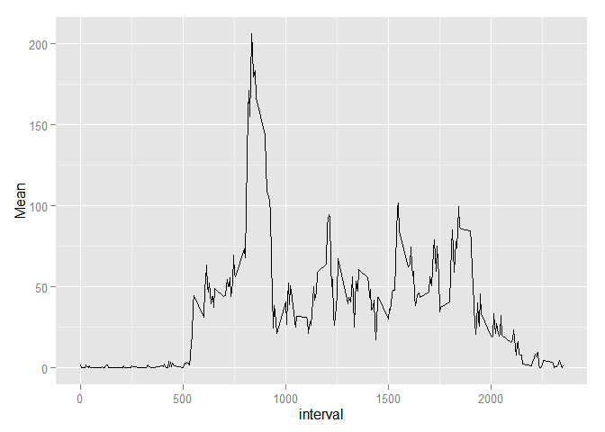
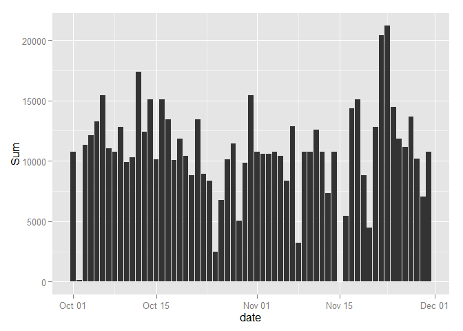
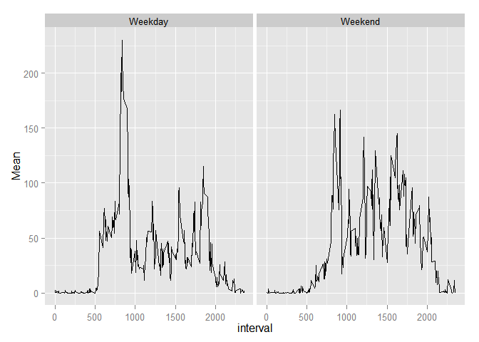

# Reproducible Research: Peer Assessment 1


## Loading and preprocessing the data
  
    
     
We load the activity dataset into our variable **dataset** and modified the column date into the **class date**.


```r
library(ggplot2)
library(plyr)
dataset <- read.csv(unz("activity.zip","activity.csv"))
dataset$date <- as.Date(dataset$date, format="%Y-%m-%d")
```


## What is mean total number of steps taken per day?

For simply calculation we ignore the **NA** in dataset


```r
omitNaData <- na.omit(dataset)

sData <- ddply(omitNaData, "date", summarise, Sum=sum(steps))
```

The graph below show the total step taken each day


```r
ggplot(sData, aes(x=date, y=Sum)) + geom_bar(stat="identity")
```

 

The below result show the of the **Mean** and **Median** respectively of the dataset without considering **NA**


```r
mean(sData$Sum)
```

```
## [1] 10766.19
```

```r
median(sData$Sum)
```

```
## [1] 10765
```

## What is the average daily activity pattern?

The below graph show the average daily activity pattern for the dataset without considering **NA**


```r
sData <- ddply(omitNaData, "interval", summarise, Mean=mean(steps))
ggplot(sData, aes(x=interval, y=Mean)) +geom_line()
```

 

The below result show the **max** step daily taken in the dataset without considering **NA**


```r
sData[sData$Mean==max(sData$Mean),]
```

```
##     interval     Mean
## 104      835 206.1698
```

## Imputing missing values

In order to make our dataset more closed to really, we are going to take into account the NA in our database  and modified it according with the below list:
- Replace a **NA** with the specific daily **mean** of the corresponding interval
- if the specific interval doesn't have a mean, it replaced with the value **0**


```r
MeanData <- ddply(omitNaData, "interval", summarise, Mean=mean(steps))

fullData <- dataset

n <- dim(fullData)[1]

for (i in 1:n) {
        if (is.na(fullData[i,1])) {
                if (length(MeanData[MeanData$interval==fullData[i,3],2])==1) {
                        fullData[i,1] <- MeanData[MeanData$interval==fullData[i,3],2]
                } else {
                        fullData[i,1] <- 0 
                }
        }
}

sData <- ddply(fullData, "date", summarise, Sum=sum(steps))
```


The below graph show the average daily activity pattern for the database with the NA modification **NA**

```r
ggplot(sData, aes(x=date, y=Sum)) + geom_bar(stat="identity")
```

 

The below graph show the average daily activity pattern for the dataset with the NA modification **NA**


```r
mean(sData$Sum)
```

```
## [1] 10766.19
```

```r
median(sData$Sum)
```

```
## [1] 10766.19
```


## Are there differences in activity patterns between weekdays and weekends?

Here we modified our dataset considering the NA modification in order to assign each  entries a level if it the day is a **Weekday** or a **Weekend**.


```r
dayData <- cbind(fullData, Day = weekdays(fullData$date))

n <- dim(fullData)[1]
Week <- rep(NA, n)

dayData <- cbind(dayData, Week)

for (i in 1:n) {
        if (sum(dayData[i,4] == c("Monday","Tuesday","Wednesday","Thursday","Friday"))==1) {
                dayData[i,5] <- "Weekday"
                
        } else {
                dayData[i,5]  <- "Weekend"
             
        }
}

sData <- ddply(dayData, c("interval", "Week"), summarise, Mean=mean(steps))
```


The below graph shows the difference between the pattern of a Weekend and Weekday 


```r
ggplot(sData, aes(x=interval, y=Mean)) + geom_line() + facet_grid(.~Week)
```

 


