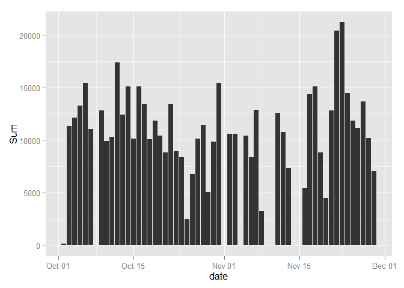
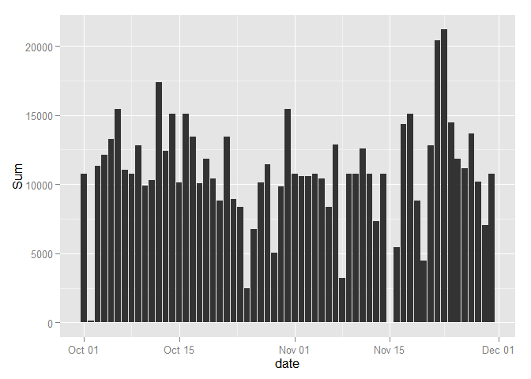

# Reproducible Research: Peer Assessment 1


## Loading and preprocessing the data


```r
library(ggplot2)
library(plyr)
dataset <- read.csv(unz("activity.zip","activity.csv"))
dataset$date <- as.Date(dataset$date, format="%Y-%m-%d")
```


## What is mean total number of steps taken per day?


```r
omitNaData <- na.omit(dataset)

sData <- ddply(omitNaData, "date", summarise, Sum=sum(steps))
ggplot(sData, aes(x=date, y=Sum)) + geom_bar(stat="identity")
```

 

```r
mean(sData$Sum)
```

```
## [1] 10766.19
```

```r
median(sData$Sum)
```

```
## [1] 10765
```


## What is the average daily activity pattern?

```r
sData <- ddply(omitNaData, "interval", summarise, Mean=mean(steps))
ggplot(sData, aes(x=interval, y=Mean)) +geom_line()
```

 

```r
sData[sData$Mean==max(sData$Mean),]
```

```
##     interval     Mean
## 104      835 206.1698
```

## Imputing missing values


```r
MeanData <- ddply(omitNaData, "interval", summarise, Mean=mean(steps))

fullData <- dataset

n <- dim(fullData)[1]

for (i in 1:n) {
        if (is.na(fullData[i,1])) {
                if (length(MeanData[MeanData$interval==fullData[i,3],2])==1) {
                        fullData[i,1] <- MeanData[MeanData$interval==fullData[i,3],2]
                } else {
                        fullData[i,1] <- 0 
                }
        }
}

sData <- ddply(fullData, "date", summarise, Sum=sum(steps))

ggplot(sData, aes(x=date, y=Sum)) + geom_bar(stat="identity")
```

 

```r
mean(sData$Sum)
```

```
## [1] 10766.19
```

```r
median(sData$Sum)
```

```
## [1] 10766.19
```


## Are there differences in activity patterns between weekdays and weekends?


```r
dayData <- cbind(fullData, Day = weekdays(fullData$date))

n <- dim(fullData)[1]
Week <- rep(NA, n)

dayData <- cbind(dayData, Week)

for (i in 1:n) {
        if (sum(dayData[i,4] == c("Monday","Tuesday","Wednesday","Thursday","Friday"))==1) {
                dayData[i,5] <- "Weekday"
                
        } else {
                dayData[i,5]  <- "Weekend"
             
        }
}

sData <- ddply(dayData, c("interval", "Week"), summarise, Mean=mean(steps))

ggplot(sData, aes(x=interval, y=Mean)) + geom_line() + facet_grid(.~Week)
```

 


